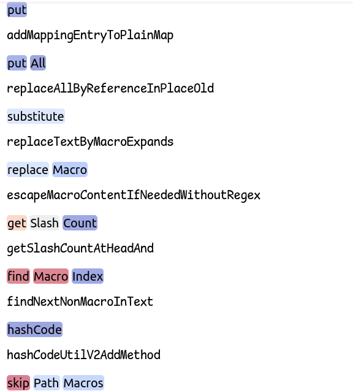

# Improving code generation with code analysis and project information

I used [IntelliJ Community](https://github.com/JetBrains/intellij-community) repository as a data source. There are many languages in it, but the most frequent was Java, so I will focus on it.

## Extraction
Initially I wanted to use parsers for this task, but `tree-sitter-java` wasn't parsing the files (even simple examples), and `javalang` produced AST, but I couldn't find the mapping to positions in code and thus couldn't extract the code of the found methods. Probably all it can be fixed, but to avoid spending too much time on it I switched to regular expressions and counting bracket balance manually, which is a simple solution and it is enough to extract enough methods for fine-tuning (300K methods and 85Mb).

To replicate this step, download the `intellij-community` repository and run `extract.py`.
```
git clone https://github.com/JetBrains/intellij-community
python3 extract.py
```
It will produce `train.csv`. For convenience, I have uploaded [it to HuggingFace](https://huggingface.co/datasets/Mlxa/java_methods).

## Fine-tuning
For this part just run `finetuning.ipynb`.

## Results
An example of model confidence (blue means good prediction) on some ground truth method names from the dataset and the corresponding generations from the model:
